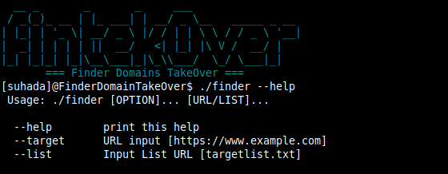

# DomainTAKEOVER


FinderDomainTakeOver Used to takeover domain or subdomain

## Support Service TakeOver

```
 AWS/S3
 Bitbucket
 Feedpress
 Ghost
 Github
 Help Juice
 Help Scout
 Intercom
 JetBrains
 Kinsta
 LaunchRock
 Pantheon
 Readme.io
 Tumblr
 UserVoice
 Smartling
 Thinkific
```

### Usage : 

$ git clone https://github.com/Himangshu30/DomainTAKEOVER

$ cd DomainTAKEOVER/

$ chmod +x finder

$ ./finder --help


